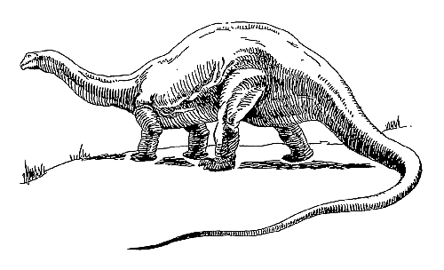

# deno-experiments

* [bayesjs/mcmc.ts](bayesjs/mcmc.ts), a port of `bayes.js` to Deno
* [bayesjs/distributions.ts](bayesjs/distributions.ts), a collection of log probability density functions (PDF)
* [ssm.ts](ssm.ts), state-space models (SSM) experiments
* [linalg/mod.ts](linalg/mod.ts), port of the _Bayes for physicists_ linear algebra library to Deno
* [opml.ts](opml.ts), a simple RSS parser
* [randomjs/mod.ts](randomjs/mod.ts), a port of `random-js` to Deno
* [bear.ts](bear.ts), tools to maniplute Bear's notes
* [readme.ts](readme.ts), script to auto-generate this repo's `README.md`
* [rss.ts](rss.ts), a simple RSS parser
